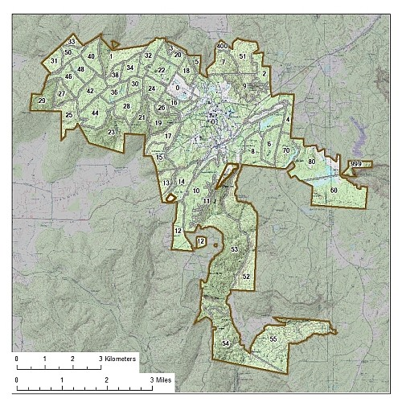
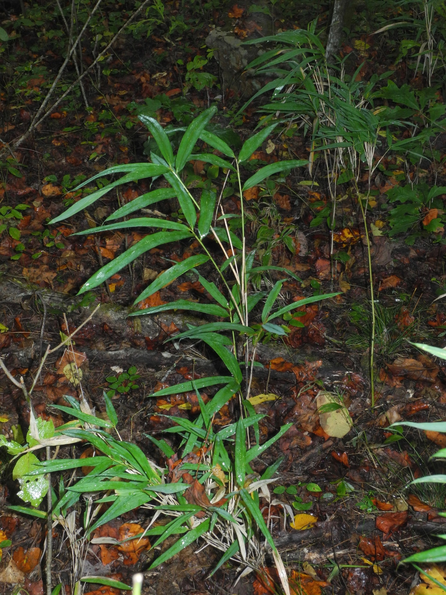

```{r setup, include=FALSE}
library(flexdashboard)
library(ggplot2)
library(dplyr)
library(knitr)
library(readr)
library(tinytable)
knitr::opts_chunk$set(echo = FALSE)
trees<- read_csv('tree_data.csv')

```

## What the is the focus?

- Creating an updated management plan for compartment 60
- Studying Arundinaria appalachiana


## My groups portion

Our group’s portion of compartment 60 is located in the Northeastern corner of the compartment. It consists of a hardwood forest that was patch cut, leaving enough trees to provide habitats and seeds, but also opening the canopy to promote understory growth. There are patches of planted shortleaf pine (Pinus echinata Mill.)mixed in with the other hardwoods. Hartsell and Muskingum soils make up the majority of the stand. You will find that Muskingum soil dominates in the Northern portion of the stand, which is classified as stony fine sandy loam and is found here due to the bluff. Hartsell soil will be found in the Southern portion of the stand, which is classified as fine sandy loam.

## Where is compatment 60?


```{r, out.width="50%"}

```

## Restoration focus

Before the University acquired compartment 60, it was being heavily harvested for timber. This has left skid and tire scars that have permanently changed the land. Once the University acquired the land in 1996, prescribed fire and clear-cutting were implemented (Turner 2019). This allowed the understory to grow, so most of the trees in this area are relatively young. Currently, the university continues to carry out prescribed burns in the area to keep the canopy open to promote Arundinaria Appalachiana growth. The prescribed burns also promote the regeneration process of Pinus Echinta (Evans and Morris 2026).

## What is Arundinaria appalachiana

Arundinaria is an extremely long-lived, slow reproducing species, cloning itself through rhizomes instead of seeds. (University of the South 2026) This requires a restoration plan that accounts for the long growing cycles to create a lasting environment conducive to the life cycle of Arundinaria.

## The Arundinaria Appalachiana
```{r, out.width="50%"}

```

## Data taken


```{r}
trees %>% 
  tt()

```

## Data shown
```{r}
ggplot(trees,
       aes(x=dbh,
           y=height,
           color=tree_id)) +
  geom_point() +
  labs(title = 'Height vs. DBH',) +
  theme_light()

```


